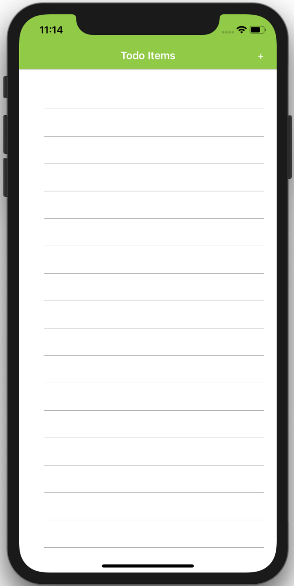

# Build a cloud app on Mac OSX

Let's start by ensuring that the environment we are using for development is up to the task of mobile development by building and running a base app.  There is a `code` folder with all the code for the book n the [GitHub repository for this book][github-repo].  

* Clone or Download the [GitHub repository][github-repo].
* Ensure you have opened XCode at least once and accepted the license terms.  Also, download any iOS simulators you want to use.  You can close XCode after this and forget it exists for a while.
* Open the `code/Chapter1` folder, then double-click the `Chapter1.sln` file to open the solution in Visual Studio for Mac.
* Right-click the `Todo.iOS` project and select **Set as Startup Project...**.
* Ensure an appropriate simulator is selected in the top-left corner:

    

* Click the Run button in the top-left corner.



You should become familiar with the code in the `Todo` project, where the majority of the code lives.  Pay particular attention to the `Todo.Data` namespace as this contains all the code necessary to communicate with the database.  It is these classes we will be adjusting for the cloud.

## Prepare for a move to the cloud

The application as designed is a fairly standard implementation with a local database and based on a standard [Xamarin.Forms sample][sample].  However, there is one major gotcha with the code.  It uses an auto-incrementing numeric integer as a unique ID.  This is a normal design pattern for database-driven applications when a single application is creating and accessing data records, but it is not suitable for an app that accesses data in the cloud in a potentially concurrent manner.  Let's say you have just produced a great task list app with such an ID that we have.  Two users are now using the app.  Both users have downloaded the data from the cloud and are up to record 5.  Now both users create a record.  Each record will be numbered 6.  What happens when the record gets updated?  Since the ID is the primary key for the database, it has to be unique within that database.  Which one "wins"?  The answer is "it depends on who writes first".  The creation of the second record will likely fail, causing the user to see an error.

Before we can connect the app to the cloud, we have to adjust the database model to use something that is globally unique across all users of the app.  Unless there is a compelling alternate reason, I suggest using [universally unique ID](https://en.wikipedia.org/wiki/Universally_unique_identifier) as the primary key of the database.  Refactoring for this, we need to:

1. Adjust the model to have an internal ID and a user-visible ID.
2. Adjust the database client to only allow the use of a user-visible ID.  It should also auto-generate the user-visible ID when necessary.
3. Adjust all the places that use the database client to ensure that only the user-visible ID is provided.

Let's take a look at the code for each of these:

### Update the TodoItem model

The first step is to separate the internal ID from the user-visible one:

```csharp
using SQLite;

namespace Todo.Data
{
    public class TodoItem
    {
        [PrimaryKey,AutoIncrement]
        public int internalID { get; set; }
        public string ID { get; set; }
        public string Name { get; set; }
        public string Notes { get; set; }
        public bool Done { get; set; }
    }
}
```

The `internalID` is only used by the database and is internal to the app.  It should not be used anywhere else and should not leak to the cloud.  The `ID` has been updated to be a string so that it can store a UUID.

### Update the TodoItemDatabase client

The usage of the internal ID is inherent in the TodoItemDatabase client, so we need to update three routines there:

* `GetItemAsync()` takes the internal ID.  It needs to be adjusted to take the user-visible ID.
* `SaveItemAsync()` returns the internal ID.  It needs to be adjusted to return the new item.
* `DeleteItemAsync()` also returns the internal ID, but that is not used by anything, so let's adjust to just return.

Here is the new code:

```csharp
public Task<TodoItem> GetItemAsync(string id)
{
    return database.Table<TodoItem>().Where(i => i.ID == id).FirstOrDefaultAsync();
}

public async Task<TodoItem> SaveItemAsync(TodoItem item)
{
    if (item.internalID != 0) {
        await database.UpdateAsync(item);
    }
    else
    {
        item.ID = Guid.NewGuid().ToString();
        int internalID = await database.InsertAsync(item);
        item.internalID = internalID;
    }
    return item;
}

public async Task DeleteItemAsync(TodoItem item)
{
    await database.DeleteAsync(item);
}
```

We also need to deal with the fact that the database we created in the last run is using the old model.  In a more challenging app, we would version the database, then migrate the data to the new database if the old database exists.  For this simple example, we can rename the database to something new:

```csharp
private static readonly string dbPath = Path.Combine(
    Environment.GetFolderPath(Environment.SpecialFolder.LocalApplicationData), 
    "todoitems2.db3"
);
```

This will wipe out any tasks that have already been created, but will not delete the old database file.

### Update the rest of the app

Fortunately, the pages within the app do not require adjustment.  If you do this sort of refactoring on your own app, you will need to go through each page within the app and ensure that the internal ID is not used anywhere.  Refactor the code wherever you see the `ID` being used.  Ensure you do not use the `internalID` in the refactoring.  We'll take a look at some of the more common pitfalls in refactoring later in the book.
